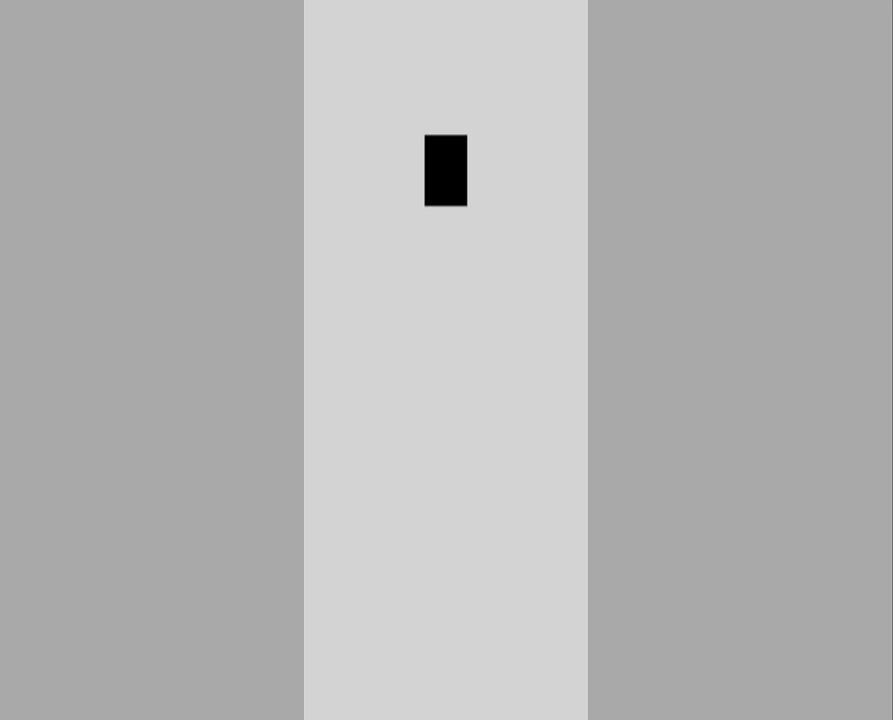

# Self-Driving-Car

It's a simple self-driving car with Neural Networks and Machine Learning in JavaScript with no frameworks and libraries.
It's in plain JavaScript to try it, simply download the files.
 
 

## Features
Control the car with arrow keys (Up, Down, Left, Right).
The car has basic movement physics, it rotates when turning and can go forward and reverse.

Added some rays that act as a sensor to detect collisions and objects on the road.
The road is designed with 3 lines maybe add some more in the future, the cars will be coming down these lanes.

For now, the car is a simple black Rectangle.

 

## Future Changes:
  <li>add car model
  <li>make the car drive it self with nerual network and machine learning
  
    
         
 

 

