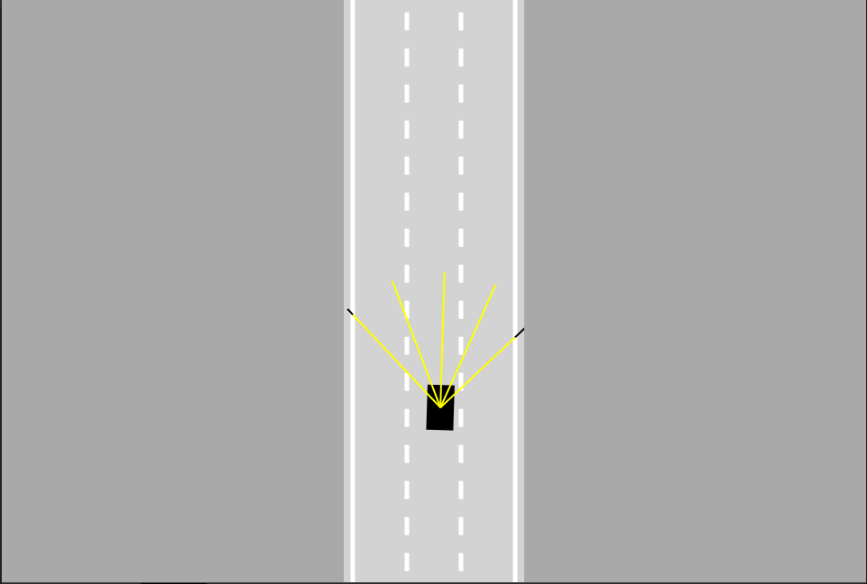

# Self-Driving-Car

It's a simple self driving car with Neural Networks and Machine Learning in Javascript with no frameworks and libraries.
Its in plain Javascript to try it simply download the files.
 

## Features
For now you can only move the car manualy (left,right,up,down) with basic arrow key controls. And the car is a simple black
rectangel.

 

## Future Changes:
  <li>better car movment
  <li>add car model
  <li>make the car drive it self
  <li>change background/work on desing
    
         
 

 

